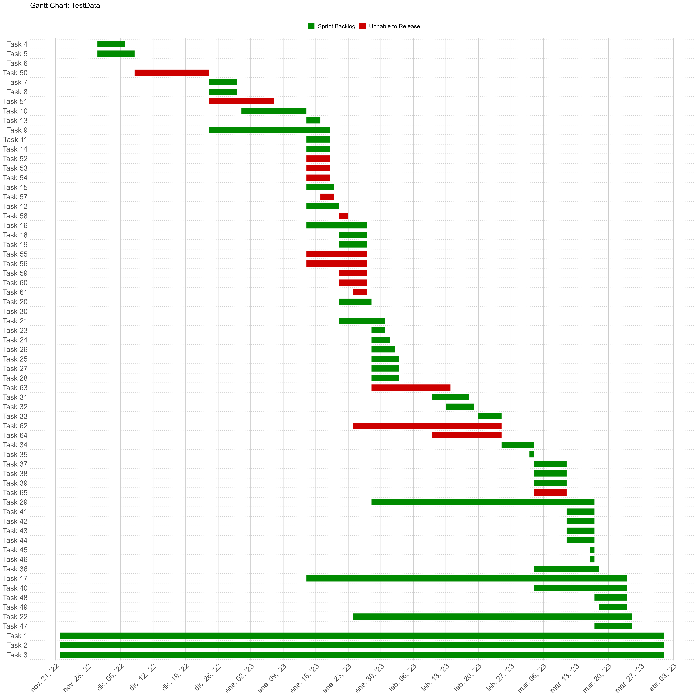

```r
# Import data
raw_timeline <- read.csv("timeline_TestData.csv")
```

## Background

This project is for creating a template to make Gantt Charts in ggplot2 using the Excel download of Monday.com's Gantt charts. This project is primarily based on [Creating a pretty Gantt chart with ggplot2](https://stats.andrewheiss.com/misc/gantt.html) by Andrew Heiss.

It's important to have the CSV dataset organized with the same variables. Because the dataset from Monday.com is not tidy at all, I performed a partial data preparedness inside Excel to have the data like the following:


```r
raw_timeline %>%
  head(., 5) %>% data.frame()
```

```
##     Task          Group     Start         End
## 1 Task 1 Sprint Backlog 22-nov-22 01-Apr-2023
## 2 Task 2 Sprint Backlog 22-nov-22 01-Apr-2023
## 3 Task 3 Sprint Backlog 22-nov-22 01-Apr-2023
## 4 Task 4 Sprint Backlog 30-nov-22 06-Dec-2022
## 5 Task 5 Sprint Backlog 30-nov-22 08-Dec-2022
```

## Data Wrangling


```r
# Clean & wrangle data

# Fix start and end dates and set groups to factors and also create long format for dates
timeline <- raw_timeline %>%
  mutate(Start = dmy(Start),
         End = dmy(End),
         Group = as.factor(Group)) %>%
  gather(date.type, task.date, -c(Group, Task)) %>%
  arrange(date.type, task.date) %>%
  mutate(Task = factor(Task, levels = rev(unique(Task)), ordered = TRUE))
```

## Data Visualization


```r
# Plot & visualize data

# TITLE:
image_file_name <- "timeline_TestData"

# Custom theme for making a clean Gantt chart
# NOTE: This theme was taken from Andrew Heiss' Creating a pretty Gantt chart with ggplot2
theme_gantt <- function(base_size = 11) {
  ret <- theme_bw(base_size) %+replace%
    theme(panel.background = element_rect(fill = "#ffffff", colour = NA),
          axis.title.x = element_text(vjust = -0.2), axis.title.y = element_text(vjust = 1.5),
          title = element_text(vjust = 1.2),
          panel.border = element_blank(), axis.line = element_blank(),
          panel.grid.minor = element_blank(),
          panel.grid.major.y = element_blank(),
          panel.grid.major.x = element_line(size = 0.5, colour = "grey80"),
          axis.ticks = element_blank(),
          legend.position = "top",
          axis.title = element_text(size = rel(0.8)),
          strip.text = element_text(size = rel(1)),
          strip.background = element_rect(fill = "#ffffff", colour = NA),
          panel.spacing.y = unit(1.5, "lines"),
          legend.key = element_blank())
  
    ret
}

# Calculate where to put the dotted lines that show up every three entries
x.breaks <- seq(length(timeline$Task) + 0.5 - 1, 0, by = -1)

# Build plot
timeline_plot <- ggplot(timeline, aes(x = Task, y = task.date, colour = Group)) + 
  geom_line(size = 6) + 
  geom_vline(xintercept = x.breaks, colour = "grey80", linetype = "dotted", size = 0.5) + 
  guides(colour = guide_legend(title = NULL)) +
  labs(title = "Gantt Chart: TestData", subtitle = "", x = NULL, y = NULL) + coord_flip() +
  scale_x_discrete(labels = label_wrap(135)) +
  scale_y_date(date_breaks = "1 week", labels = date_format("%b %d, ‘%y")) +
  scale_color_manual(values = c("green4", "red3", "blue4", "grey45")) +
  theme_gantt() + theme(axis.text.x = element_text(angle = 45, hjust = 1),
                        axis.text = element_text(size = 15),
                        legend.text = element_text(size = 12),
                        plot.title = element_text(size = 15))

# Save plot as high resolution PNG (the secret is 'type="cairo", dpi=300')
ggsave(timeline_plot, filename = paste(image_file_name,".png"),
       width = 20, height = 20, units = "in", type = "cairo", dpi = 300, limitsize = FALSE)
```


