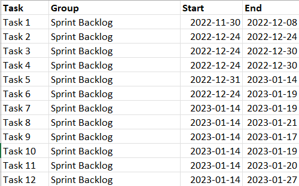

# Gantt Charts in R's ggplot2

This project is for creating a template to make Gantt Charts in ggplot2 using the speficied format and variables labelling. This project is mostly based on [Creating a pretty Gantt chart with ggplot2](https://stats.andrewheiss.com/misc/gantt.html) by Andrew Heiss. I added my chart customization preferences on top of it.

It's important to have the CSV dataset organized with the same variables like the following:

__*NOTE:__ If you have more variables in your dataset, you might need to select only the four needed or adjust the `gather()` function to ignore the extra variables. 

